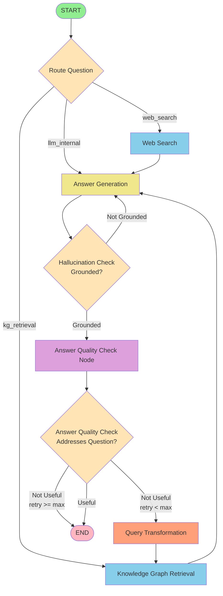

# Adaptive RAG Workflow - Mermaid Diagram

## Full Workflow (All Grading Enabled)


## Simplified Workflow (Document Grading Disabled, Generation Grading Enabled)



## Minimal Workflow (All Grading Disabled)


## Legend

- 🟢 **Green (Light)**: Start/End nodes
- 🟡 **Yellow (Light)**: Processing nodes (Web Search, KG Retrieval, Answer Generation)
- 🟠 **Orange (Light)**: Query Transformation
- 🔵 **Blue (Light)**: Data retrieval nodes
- 🟣 **Purple (Light)**: Grading/checking nodes
- 💠 **Diamond**: Decision points

## Workflow Configuration Options

### API Request Parameters

```json
{
    "question": "Your question here",
    "n_retrieved_documents": 3,
    "n_web_searches": 3,
    "node_retrieval": true,
    "edge_retrieval": true,
    "episode_retrieval": true,
    "community_retrieval": true,
    "enable_retrieved_documents_grading": true,
    "enable_generation_grading": true
}
```

### Decision Points

1. **Route Question**: Routes to one of three paths based on question type:
   - `web_search`: Latest information needed
   - `kg_retrieval`: Domain-specific knowledge needed
   - `llm_internal`: Out-of-domain questions (no retrieval)

2. **Decide to Generate** (only when document grading enabled):
   - Checks if retrieved documents are relevant
   - Falls back to web search after max retries
   - Otherwise transforms query and retries

3. **Hallucination Check** (only when generation grading enabled):
   - Verifies answer is grounded in retrieved context
   - Regenerates if not grounded

4. **Answer Quality Check** (only when generation grading enabled):
   - Validates answer addresses the question
   - Transforms query if not useful (with retry limit)

### Retry Logic

- Maximum retries: 3 (configurable via `Defaults.MAX_RETRY_COUNT`)
- After max retries in document grading: fallback to web search
- After max retries in quality check: return best-effort answer

### Performance Trade-offs

| Configuration | Speed | Quality | Use Case |
|--------------|-------|---------|----------|
| All grading enabled | Slowest (~15-20s) | Highest | Production, accuracy critical |
| Document grading only | Medium (~10-12s) | High | Balanced performance |
| Generation grading only | Medium (~12-15s) | High | When documents are pre-filtered |
| All grading disabled | Fastest (~5-7s) | Lower | Development, speed critical |

