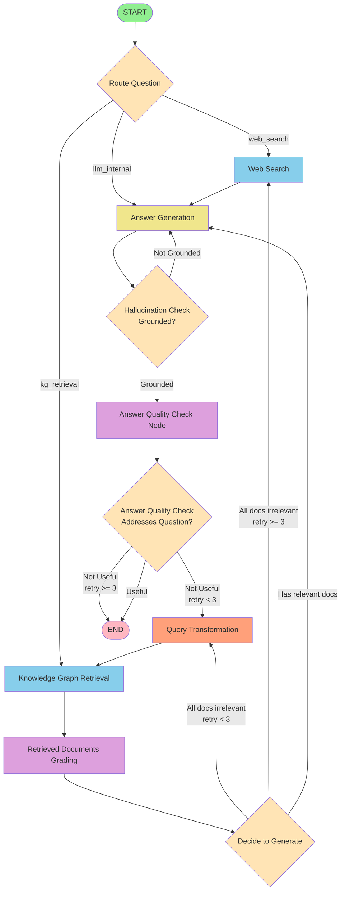
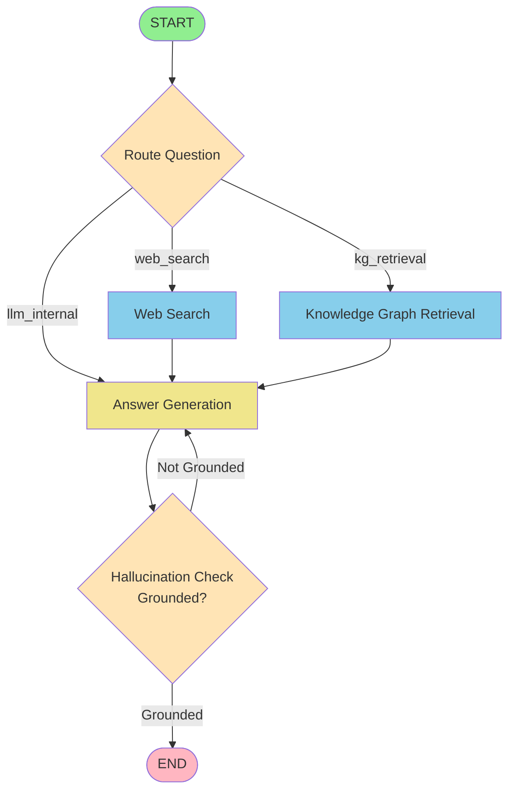
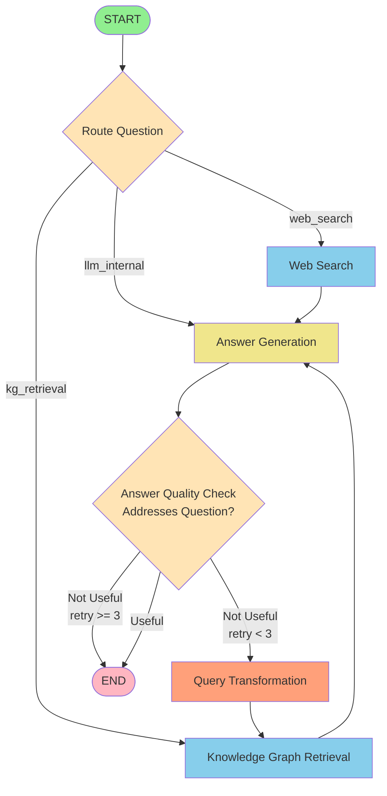
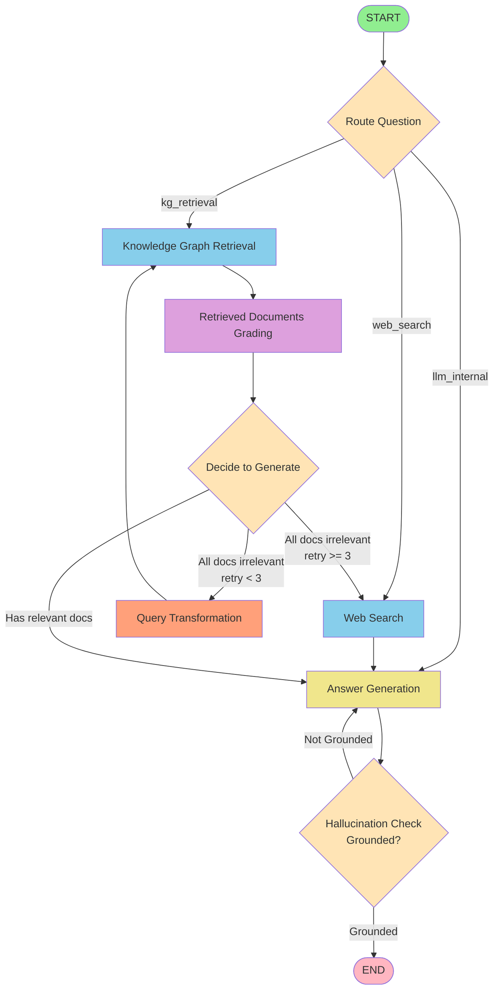
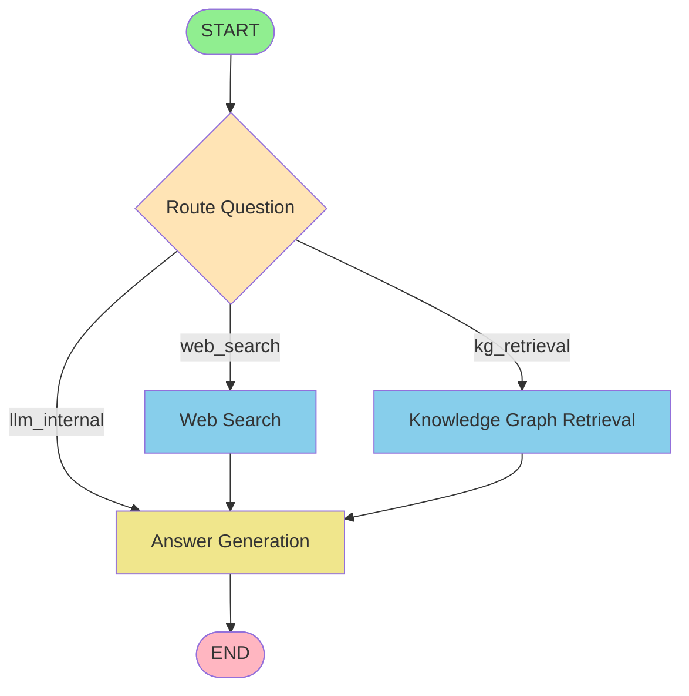
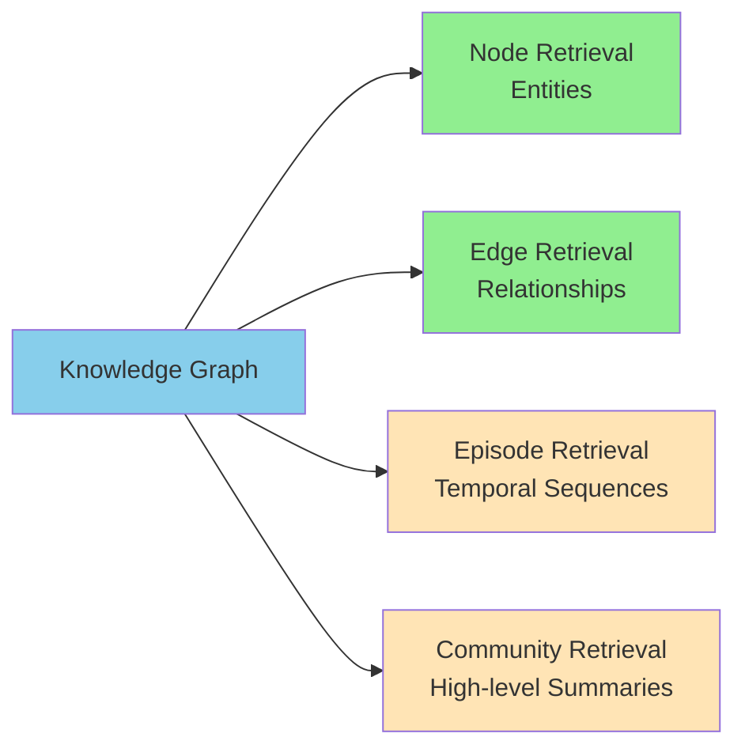

# Adaptive RAG Workflow Diagrams

## Overview

The Adaptive RAG system supports flexible configuration with independent control over:
1. **Document Grading**: Filter retrieved documents for relevance
2. **Hallucination Checking**: Verify answer is grounded in context
3. **Answer Quality Checking**: Ensure answer addresses the question

## Full Workflow (All Checks Enabled)



**Configuration:**
```json
{
    "enable_retrieved_documents_grading": true,
    "enable_hallucination_checking": true,
    "enable_answer_quality_checking": true
}
```

## Hallucination Check Only



**Configuration:**
```json
{
    "enable_retrieved_documents_grading": false,
    "enable_hallucination_checking": true,
    "enable_answer_quality_checking": false
}
```

## Answer Quality Check Only



**Configuration:**
```json
{
    "enable_retrieved_documents_grading": false,
    "enable_hallucination_checking": false,
    "enable_answer_quality_checking": true
}
```

## Document Grading + Hallucination Check (Recommended)



**Configuration:**
```json
{
    "enable_retrieved_documents_grading": true,
    "enable_hallucination_checking": true,
    "enable_answer_quality_checking": false
}
```

## Minimal Workflow (Maximum Speed)



**Configuration:**
```json
{
    "enable_retrieved_documents_grading": false,
    "enable_hallucination_checking": false,
    "enable_answer_quality_checking": false
}
```

## Legend

### Node Types
- 🟢 **Green (Light)**: Start/End nodes
- 🔵 **Blue (Light)**: Data retrieval nodes (Web Search, KG Retrieval)
- 🟡 **Yellow (Light)**: Processing nodes (Answer Generation)
- 🟠 **Orange (Light)**: Query Transformation
- 🟣 **Purple (Light)**: Grading/checking nodes
- 💠 **Diamond (Orange)**: Decision points

### Decision Points

#### 1. Route Question
Routes based on question type:
- **web_search**: Latest information needed
- **kg_retrieval**: Domain-specific knowledge needed  
- **llm_internal**: Out-of-domain questions

#### 2. Decide to Generate (Document Grading)
- Checks if any documents are relevant
- Falls back to web search after 3 retries
- Otherwise transforms query and retries

#### 3. Hallucination Check
- Verifies answer is grounded in context
- Regenerates if not grounded
- No retry limit (regenerates until grounded or timeout)

#### 4. Answer Quality Check
- Validates answer addresses question
- Transforms query if not useful (max 3 retries)
- Returns best-effort answer after max retries

## Performance Comparison

| Configuration | Processing Time | Accuracy | Use Case |
|--------------|----------------|----------|----------|
| All enabled | ~15-20s | ⭐⭐⭐⭐⭐ | Production |
| Doc + Hallucination | ~10-12s | ⭐⭐⭐⭐ | Recommended |
| Hallucination only | ~8-10s | ⭐⭐⭐ | Fast + Accurate |
| Quality only | ~10-12s | ⭐⭐⭐⭐ | Pre-filtered docs |
| Doc only | ~7-9s | ⭐⭐⭐ | Trust LLM |
| All disabled | ~5-7s | ⭐⭐ | Development |

## Configuration Matrix

| Doc Grading | Hallucination | Quality | Speed | Quality | Best For |
|-------------|---------------|---------|-------|---------|----------|
| ✅ | ✅ | ✅ | ⭐ | ⭐⭐⭐⭐⭐ | Production |
| ✅ | ✅ | ❌ | ⭐⭐ | ⭐⭐⭐⭐ | Recommended |
| ✅ | ❌ | ✅ | ⭐⭐ | ⭐⭐⭐⭐ | Quality focus |
| ✅ | ❌ | ❌ | ⭐⭐⭐ | ⭐⭐⭐ | Doc filtering |
| ❌ | ✅ | ✅ | ⭐⭐⭐ | ⭐⭐⭐⭐ | Pre-filtered |
| ❌ | ✅ | ❌ | ⭐⭐⭐⭐ | ⭐⭐⭐ | Fast accurate |
| ❌ | ❌ | ✅ | ⭐⭐⭐⭐ | ⭐⭐⭐ | Relevance focus |
| ❌ | ❌ | ❌ | ⭐⭐⭐⭐⭐ | ⭐⭐ | Development |

## Knowledge Graph Retrieval Types

The system supports 4 types of KG retrieval (all can be toggled independently):



**Defaults:**
- `node_retrieval`: **true** (always recommended)
- `edge_retrieval`: **true** (recommended for understanding relationships)
- `episode_retrieval`: **false** (enable for temporal/sequential info)
- `community_retrieval`: **false** (enable for high-level overviews)

## API Endpoints

### POST `/workflow/run`
Full workflow with detailed steps and citations.

### POST `/workflow/run-simple`
Simplified endpoint returning only question and answer.

Both endpoints accept the same request parameters and configuration options.
